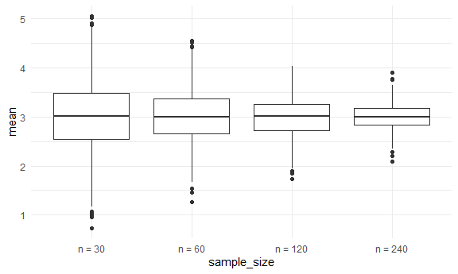
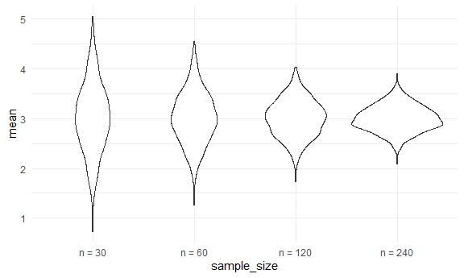

Simulation
================
Sarahy Martinez
2024-10-31

``` r
library(tidyverse)
```

    ## ── Attaching core tidyverse packages ──────────────────────── tidyverse 2.0.0 ──
    ## ✔ dplyr     1.1.4     ✔ readr     2.1.5
    ## ✔ forcats   1.0.0     ✔ stringr   1.5.1
    ## ✔ ggplot2   3.5.1     ✔ tibble    3.2.1
    ## ✔ lubridate 1.9.3     ✔ tidyr     1.3.1
    ## ✔ purrr     1.0.2     
    ## ── Conflicts ────────────────────────────────────────── tidyverse_conflicts() ──
    ## ✖ dplyr::filter() masks stats::filter()
    ## ✖ dplyr::lag()    masks stats::lag()
    ## ℹ Use the conflicted package (<http://conflicted.r-lib.org/>) to force all conflicts to become errors

``` r
library(rvest)
```

    ## 
    ## Attaching package: 'rvest'
    ## 
    ## The following object is masked from 'package:readr':
    ## 
    ##     guess_encoding

``` r
knitr::opts_chunk$set(
  fig.width = 6,
  fig.asp = .6,
  out.width = "90%:"
  
)


theme_set(theme_minimal()+ theme(legend.position = "bottom"))


options(
  ggplot2.continuous.colour = "viridis",
  ggplot2.continuous.fill = "viridis"
)

set.seed(1)
```

## Lets simulate something

I have a function

``` r
sim_mean_sd= function(sample_size, mu =3 , sigma = 4 ) {
  
  
  sim_data=
    
  tibble(
    
    x= rnorm(n= sample_size, mean = mu, sd=sigma)  # creating a tibble (table of values), with diff mean and SD
  )

  
sim_data %>% 
  summarize(
    mean = mean(x),
    sd = sd(x)
  )

}
```

I can simulate by running this line

``` r
sim_mean_sd(30)  # we can rerun but suppose we do this over and over what do the distributions of means look like? 
```

    ## # A tibble: 1 × 2
    ##    mean    sd
    ##   <dbl> <dbl>
    ## 1  3.33  3.70

## Lets simulate alot…

How can we actually formally do this in a way where we dont have to run
the same line of code over and over again

Lets start with a for loop.

We need the output and the for loop itself

``` r
output = vector("list", length = 100)

for (i in 1:100){     #if this is all we do will run over and over, so need output when you run and say i=3, 4, 5 etc 
  
  output[[i]]= sim_mean_sd(sample_size = 30)    # if we just run the output will return all 100 mean and sd
  
  
}


# take the list and bind rows will be more managable and creates a tibble 


bind_rows(output)
```

    ## # A tibble: 100 × 2
    ##     mean    sd
    ##    <dbl> <dbl>
    ##  1  3.53  3.18
    ##  2  3.44  3.84
    ##  3  3.45  3.53
    ##  4  1.68  3.69
    ##  5  3.95  4.22
    ##  6  3.27  4.34
    ##  7  2.05  4.05
    ##  8  3.10  3.72
    ##  9  3.55  4.11
    ## 10  3.87  3.79
    ## # ℹ 90 more rows

``` r
# this is 100 times I've gone into the universe and got the mean and sd, this is what happened the first time, second, etc. 
```

Lets use a loop function

Notice we only have an output but not an input list. So rn we have no
input and we want to do the same thing over and over again. In purr we
will use the function rerun.

``` r
sim_results = rerun( 100, sim_mean_sd(sample_size = 30)) %>% 
  bind_rows()
```

    ## Warning: `rerun()` was deprecated in purrr 1.0.0.
    ## ℹ Please use `map()` instead.
    ##   # Previously
    ##   rerun(100, sim_mean_sd(sample_size = 30))
    ## 
    ##   # Now
    ##   map(1:100, ~ sim_mean_sd(sample_size = 30))
    ## This warning is displayed once every 8 hours.
    ## Call `lifecycle::last_lifecycle_warnings()` to see where this warning was
    ## generated.

``` r
# different this time bc when get ask for new sample get a new sample. but setting seed can make r start at the same point
```

Let’s look at the results

``` r
sim_results %>% 
  ggplot(aes(x = mean)) + geom_density()
```


``` r
sim_results %>% 
  summarize(
    
    avg_samp_mean = mean(mean),
    sd_samp_mean = sd(mean)
  )
```

    ## # A tibble: 1 × 2
    ##   avg_samp_mean sd_samp_mean
    ##           <dbl>        <dbl>
    ## 1          2.98        0.756

``` r
sim_results %>% 
  ggplot(aes(x = sd)) + geom_density()
```


``` r
# distribution of sd is harder to do because its not normally distributed 
```

Alot of things depend on sample size. We should see if we start changing
n does the distribution of x bar change.

## Lets try other sample sizes

``` r
n_list = 
  list(
  # our input list, things are gonna get weird bc when n =30 we say run it 500, 60 run it 100 times, the output should match the same size as the input 
 " n = 30 " = 30,
 " n = 60 " = 60,
 " n = 120 " = 120,
 " n = 240 " = 240
  
)

output = vector("list", length = 4 )

output[[1]]= rerun(100, sim_mean_sd(sample_size = n_list[[1]])) %>% bind_rows()  # rerun 100x, rerun mean and sd 100x and sample size is the size of the firs element
```

    ## Warning: `rerun()` was deprecated in purrr 1.0.0.
    ## ℹ Please use `map()` instead.
    ##   # Previously
    ##   rerun(100, sim_mean_sd(sample_size = n_list[[1]]))
    ## 
    ##   # Now
    ##   map(1:100, ~ sim_mean_sd(sample_size = n_list[[1]]))
    ## This warning is displayed once every 8 hours.
    ## Call `lifecycle::last_lifecycle_warnings()` to see where this warning was
    ## generated.

``` r
output[[2]]= rerun(100, sim_mean_sd(sample_size = n_list[[2]])) %>% bind_rows() # can do this but we want to avoid so we are going to do a for loop
```

    ## Warning: `rerun()` was deprecated in purrr 1.0.0.
    ## ℹ Please use `map()` instead.
    ##   # Previously
    ##   rerun(100, sim_mean_sd(sample_size = n_list[[2]]))
    ## 
    ##   # Now
    ##   map(1:100, ~ sim_mean_sd(sample_size = n_list[[2]]))
    ## This warning is displayed once every 8 hours.
    ## Call `lifecycle::last_lifecycle_warnings()` to see where this warning was
    ## generated.

``` r
for(i in 1:4 ){
  
 output[[i]] = 
   rerun(100, sim_mean_sd(sample_size = n_list[[i]])) %>% # input we care abt and output we care , we will map this 
   bind_rows #bind rows to make sure everything works 
}
```

    ## Warning: `rerun()` was deprecated in purrr 1.0.0.
    ## ℹ Please use `map()` instead.
    ##   # Previously
    ##   rerun(100, sim_mean_sd(sample_size = n_list[[i]]))
    ## 
    ##   # Now
    ##   map(1:100, ~ sim_mean_sd(sample_size = n_list[[i]]))
    ## This warning is displayed once every 8 hours.
    ## Call `lifecycle::last_lifecycle_warnings()` to see where this warning was
    ## generated.

Start using rerun functions, map functions etc. We have a first sample
size and run it 400x etc We want to keep everything in a dataframe.

``` r
tibble(
  
  sample_size = c(30,60,120,240)
) %>% 
  mutate(
    output_lists = map(.x = sample_size, ~ rerun(10, sim_mean_sd(.x)))#input,#function you want to apply .x is sample size
    
  ) %>%  pull(output_lists) # now we have a list of lists 
```

    ## Warning: There was 1 warning in `mutate()`.
    ## ℹ In argument: `output_lists = map(.x = sample_size, ~rerun(10,
    ##   sim_mean_sd(.x)))`.
    ## Caused by warning:
    ## ! `rerun()` was deprecated in purrr 1.0.0.
    ## ℹ Please use `map()` instead.
    ##   # Previously
    ##   rerun(10, sim_mean_sd(.x))
    ## 
    ##   # Now
    ##   map(1:10, ~ sim_mean_sd(.x))

    ## [[1]]
    ## [[1]][[1]]
    ## # A tibble: 1 × 2
    ##    mean    sd
    ##   <dbl> <dbl>
    ## 1  3.25  3.66
    ## 
    ## [[1]][[2]]
    ## # A tibble: 1 × 2
    ##    mean    sd
    ##   <dbl> <dbl>
    ## 1  3.37  3.90
    ## 
    ## [[1]][[3]]
    ## # A tibble: 1 × 2
    ##    mean    sd
    ##   <dbl> <dbl>
    ## 1  2.21  3.70
    ## 
    ## [[1]][[4]]
    ## # A tibble: 1 × 2
    ##    mean    sd
    ##   <dbl> <dbl>
    ## 1  3.51  3.66
    ## 
    ## [[1]][[5]]
    ## # A tibble: 1 × 2
    ##    mean    sd
    ##   <dbl> <dbl>
    ## 1  3.17  5.27
    ## 
    ## [[1]][[6]]
    ## # A tibble: 1 × 2
    ##    mean    sd
    ##   <dbl> <dbl>
    ## 1  4.29  3.58
    ## 
    ## [[1]][[7]]
    ## # A tibble: 1 × 2
    ##    mean    sd
    ##   <dbl> <dbl>
    ## 1  2.58  4.61
    ## 
    ## [[1]][[8]]
    ## # A tibble: 1 × 2
    ##    mean    sd
    ##   <dbl> <dbl>
    ## 1  2.67  4.40
    ## 
    ## [[1]][[9]]
    ## # A tibble: 1 × 2
    ##    mean    sd
    ##   <dbl> <dbl>
    ## 1  2.87  4.57
    ## 
    ## [[1]][[10]]
    ## # A tibble: 1 × 2
    ##    mean    sd
    ##   <dbl> <dbl>
    ## 1  3.86  4.16
    ## 
    ## 
    ## [[2]]
    ## [[2]][[1]]
    ## # A tibble: 1 × 2
    ##    mean    sd
    ##   <dbl> <dbl>
    ## 1  2.51  3.99
    ## 
    ## [[2]][[2]]
    ## # A tibble: 1 × 2
    ##    mean    sd
    ##   <dbl> <dbl>
    ## 1  3.54  3.94
    ## 
    ## [[2]][[3]]
    ## # A tibble: 1 × 2
    ##    mean    sd
    ##   <dbl> <dbl>
    ## 1  2.54  4.05
    ## 
    ## [[2]][[4]]
    ## # A tibble: 1 × 2
    ##    mean    sd
    ##   <dbl> <dbl>
    ## 1  3.59  4.19
    ## 
    ## [[2]][[5]]
    ## # A tibble: 1 × 2
    ##    mean    sd
    ##   <dbl> <dbl>
    ## 1  3.01  3.97
    ## 
    ## [[2]][[6]]
    ## # A tibble: 1 × 2
    ##    mean    sd
    ##   <dbl> <dbl>
    ## 1  2.63  4.02
    ## 
    ## [[2]][[7]]
    ## # A tibble: 1 × 2
    ##    mean    sd
    ##   <dbl> <dbl>
    ## 1  3.63  4.05
    ## 
    ## [[2]][[8]]
    ## # A tibble: 1 × 2
    ##    mean    sd
    ##   <dbl> <dbl>
    ## 1  3.54  3.51
    ## 
    ## [[2]][[9]]
    ## # A tibble: 1 × 2
    ##    mean    sd
    ##   <dbl> <dbl>
    ## 1  1.58  3.98
    ## 
    ## [[2]][[10]]
    ## # A tibble: 1 × 2
    ##    mean    sd
    ##   <dbl> <dbl>
    ## 1  2.73  3.80
    ## 
    ## 
    ## [[3]]
    ## [[3]][[1]]
    ## # A tibble: 1 × 2
    ##    mean    sd
    ##   <dbl> <dbl>
    ## 1  2.71  4.18
    ## 
    ## [[3]][[2]]
    ## # A tibble: 1 × 2
    ##    mean    sd
    ##   <dbl> <dbl>
    ## 1  3.53  4.39
    ## 
    ## [[3]][[3]]
    ## # A tibble: 1 × 2
    ##    mean    sd
    ##   <dbl> <dbl>
    ## 1  3.19  4.06
    ## 
    ## [[3]][[4]]
    ## # A tibble: 1 × 2
    ##    mean    sd
    ##   <dbl> <dbl>
    ## 1  2.46  3.90
    ## 
    ## [[3]][[5]]
    ## # A tibble: 1 × 2
    ##    mean    sd
    ##   <dbl> <dbl>
    ## 1  3.30  3.55
    ## 
    ## [[3]][[6]]
    ## # A tibble: 1 × 2
    ##    mean    sd
    ##   <dbl> <dbl>
    ## 1  2.62  3.96
    ## 
    ## [[3]][[7]]
    ## # A tibble: 1 × 2
    ##    mean    sd
    ##   <dbl> <dbl>
    ## 1  3.36  3.93
    ## 
    ## [[3]][[8]]
    ## # A tibble: 1 × 2
    ##    mean    sd
    ##   <dbl> <dbl>
    ## 1  3.30  4.27
    ## 
    ## [[3]][[9]]
    ## # A tibble: 1 × 2
    ##    mean    sd
    ##   <dbl> <dbl>
    ## 1  3.48  3.83
    ## 
    ## [[3]][[10]]
    ## # A tibble: 1 × 2
    ##    mean    sd
    ##   <dbl> <dbl>
    ## 1  2.89  4.26
    ## 
    ## 
    ## [[4]]
    ## [[4]][[1]]
    ## # A tibble: 1 × 2
    ##    mean    sd
    ##   <dbl> <dbl>
    ## 1  3.18  4.17
    ## 
    ## [[4]][[2]]
    ## # A tibble: 1 × 2
    ##    mean    sd
    ##   <dbl> <dbl>
    ## 1  2.99  3.83
    ## 
    ## [[4]][[3]]
    ## # A tibble: 1 × 2
    ##    mean    sd
    ##   <dbl> <dbl>
    ## 1  2.80  3.72
    ## 
    ## [[4]][[4]]
    ## # A tibble: 1 × 2
    ##    mean    sd
    ##   <dbl> <dbl>
    ## 1  2.71  4.21
    ## 
    ## [[4]][[5]]
    ## # A tibble: 1 × 2
    ##    mean    sd
    ##   <dbl> <dbl>
    ## 1  3.17  4.01
    ## 
    ## [[4]][[6]]
    ## # A tibble: 1 × 2
    ##    mean    sd
    ##   <dbl> <dbl>
    ## 1  3.31  3.96
    ## 
    ## [[4]][[7]]
    ## # A tibble: 1 × 2
    ##    mean    sd
    ##   <dbl> <dbl>
    ## 1  2.90  3.79
    ## 
    ## [[4]][[8]]
    ## # A tibble: 1 × 2
    ##    mean    sd
    ##   <dbl> <dbl>
    ## 1  3.22  3.98
    ## 
    ## [[4]][[9]]
    ## # A tibble: 1 × 2
    ##    mean    sd
    ##   <dbl> <dbl>
    ## 1  2.74  4.34
    ## 
    ## [[4]][[10]]
    ## # A tibble: 1 × 2
    ##    mean    sd
    ##   <dbl> <dbl>
    ## 1  2.91  3.98

``` r
# produces tibble size 4 with sample size 30 and list of size 10
```

``` r
sim_results = tibble(
  sample_size = c(30,60,120,240)
) %>% 
  mutate(
    output_lists = map(.x = sample_size, ~ rerun(10, sim_mean_sd(.x))),#input,#function you want to apply .x is sample size
    estimate_df = map(output_lists, bind_rows)
  ) %>% 
  select(-output_lists) %>% #unest a dataframe, prev nested a large df to a single now we try to make larger
  unnest(estimate_df)
  
# it has expanded out each of the subdataframes. now we took the tibble of estimate_df and expanded it hwhere it was 10 rows for size 30 , 60,etc. SO then now we have an overall tibble size of 40 x3 including sample size, mean and sd

sim_results_1000 = tibble(
  sample_size = c(30,60,120,240)
) %>% 
  mutate(
    output_lists = map(.x = sample_size, ~ rerun(1000, sim_mean_sd(.x))),#input,#function you want to apply .x is sample size
    estimate_df = map(output_lists, bind_rows)
  ) %>% 
  select(-output_lists) %>% #unest a dataframe, prev nested a large df to a single now we try to make larger
  unnest(estimate_df)
```

    ## Warning: There was 1 warning in `mutate()`.
    ## ℹ In argument: `output_lists = map(.x = sample_size, ~rerun(1000,
    ##   sim_mean_sd(.x)))`.
    ## Caused by warning:
    ## ! `rerun()` was deprecated in purrr 1.0.0.
    ## ℹ Please use `map()` instead.
    ##   # Previously
    ##   rerun(1000, sim_mean_sd(.x))
    ## 
    ##   # Now
    ##   map(1:1000, ~ sim_mean_sd(.x))

``` r
# now we have 4000 simulated datasets. 1000 each at 4 diff sample sizes 
```

Do some dataframe things

``` r
sim_results_1000 %>% 
  mutate(
    sample_size = str_c("n = ", sample_size),
    sample_size = fct_inorder(sample_size) # places in order
  ) %>% 
  ggplot(aes( x = sample_size, y = mean)) + geom_boxplot() # now we have slight problem bc ordering doesn't make sense 
```



``` r
# getting an idea of repeated sampling when we are discussing the mean 

sim_results_1000 %>% 
  mutate(
    sample_size = str_c("n = ", sample_size),
    sample_size = fct_inorder(sample_size) # places in order
  ) %>% 
  ggplot(aes( x = sample_size, y = mean)) + geom_violin()  
```



``` r
# violin bc we can see more clearly that it is a symmetric distribution 
```

``` r
sim_results_1000%>% 
  group_by(sample_size) %>% 
  summarize(avg_samp_mean = mean(mean),
  sd_samp_mean = sd(mean)        
  )
```

    ## # A tibble: 4 × 3
    ##   sample_size avg_samp_mean sd_samp_mean
    ##         <dbl>         <dbl>        <dbl>
    ## 1          30          3.02        0.709
    ## 2          60          3.01        0.521
    ## 3         120          3.00        0.377
    ## 4         240          3.00        0.261

``` r
# each time the avg sample mean should be where they are. not exact but are close since we are running at 1000 times.
```

Right now when we knit and hits the 100 and 1000 simulation can take a
long amt of time. If we dont want to wait there is an option in R that
we can CACHE the results and save them. Downside is that its easy to
break. So if we are using something that takes a lont time to run we can
cache the results. We can also set the seed.

set.seed will continue to give you the same numbers everytime you start
setting. Everytime you knit will give you the same random numbers.
