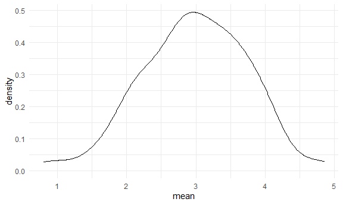

Simulation
================
Sarahy Martinez
2024-10-31

``` r
library(tidyverse)
```

    ## ── Attaching core tidyverse packages ──────────────────────── tidyverse 2.0.0 ──
    ## ✔ dplyr     1.1.4     ✔ readr     2.1.5
    ## ✔ forcats   1.0.0     ✔ stringr   1.5.1
    ## ✔ ggplot2   3.5.1     ✔ tibble    3.2.1
    ## ✔ lubridate 1.9.3     ✔ tidyr     1.3.1
    ## ✔ purrr     1.0.2     
    ## ── Conflicts ────────────────────────────────────────── tidyverse_conflicts() ──
    ## ✖ dplyr::filter() masks stats::filter()
    ## ✖ dplyr::lag()    masks stats::lag()
    ## ℹ Use the conflicted package (<http://conflicted.r-lib.org/>) to force all conflicts to become errors

``` r
library(rvest)
```

    ## 
    ## Attaching package: 'rvest'
    ## 
    ## The following object is masked from 'package:readr':
    ## 
    ##     guess_encoding

``` r
knitr::opts_chunk$set(
  fig.width = 6,
  fig.asp = .6,
  out.width = "90%:"
  
)


theme_set(theme_minimal()+ theme(legend.position = "bottom"))


options(
  ggplot2.continuous.colour = "viridis",
  ggplot2.continuous.fill = "viridis"
)
```

## Lets simulate something

I have a function

``` r
sim_mean_sd= function(sample_size, mu =3 , sigma = 4 ) {
  
  
  sim_data=
    
  tibble(
    
    x= rnorm(n= sample_size, mean = mu, sd=sigma)  # creating a tibble (table of values), with diff mean and SD
  )

  
sim_data %>% 
  summarize(
    mean = mean(x),
    sd = sd(x)
  )

}
```

I can simulate by running this line

``` r
sim_mean_sd(30)  # we can rerun but suppose we do this over and over what do the distributions of means look like? 
```

    ## # A tibble: 1 × 2
    ##    mean    sd
    ##   <dbl> <dbl>
    ## 1  2.85  4.41

## Lets simulate alot…

How can we actually formally do this in a way where we dont have to run
the same line of code over and over again

Lets start with a for loop.

We need the output and the for loop itself

``` r
output = vector("list", length = 100)

for (i in 1:100){     #if this is all we do will run over and over, so need output when you run and say i=3, 4, 5 etc 
  
  output[[i]]= sim_mean_sd(sample_size = 30)    # if we just run the output will return all 100 mean and sd
  
  
}


# take the list and bind rows will be more managable and creates a tibble 


bind_rows(output)
```

    ## # A tibble: 100 × 2
    ##     mean    sd
    ##    <dbl> <dbl>
    ##  1  2.18  4.48
    ##  2  3.08  3.83
    ##  3  2.58  4.83
    ##  4  2.20  4.15
    ##  5  3.50  3.74
    ##  6  3.48  3.83
    ##  7  2.48  4.53
    ##  8  2.21  3.97
    ##  9  3.11  3.28
    ## 10  2.49  4.25
    ## # ℹ 90 more rows

``` r
# this is 100 times I've gone into the universe and got the mean and sd, this is what happened the first time, second, etc. 
```

Lets use a loop function

Notice we only have an output but not an input list. So rn we have no
input and we want to do the same thing over and over again. In purr we
will use the function rerun.

``` r
sim_results = rerun( 100, sim_mean_sd(sample_size = 30)) %>% 
  bind_rows()
```

    ## Warning: `rerun()` was deprecated in purrr 1.0.0.
    ## ℹ Please use `map()` instead.
    ##   # Previously
    ##   rerun(100, sim_mean_sd(sample_size = 30))
    ## 
    ##   # Now
    ##   map(1:100, ~ sim_mean_sd(sample_size = 30))
    ## This warning is displayed once every 8 hours.
    ## Call `lifecycle::last_lifecycle_warnings()` to see where this warning was
    ## generated.

``` r
# different this time bc when get ask for new sample get a new sample. but setting seed can make r start at the same point
```

Let’s look at the results

``` r
sim_results %>% 
  ggplot(aes(x = mean)) + geom_density()
```



``` r
sim_results %>% 
  summarize(
    
    avg_samp_mean = mean(mean),
    sd_samp_mean = sd(mean)
  )
```

    ## # A tibble: 1 × 2
    ##   avg_samp_mean sd_samp_mean
    ##           <dbl>        <dbl>
    ## 1          3.03        0.669

``` r
sim_results %>% 
  ggplot(aes(x = sd)) + geom_density()
```


``` r
# distribution of sd is harder to do because its not normally distributed 
```
